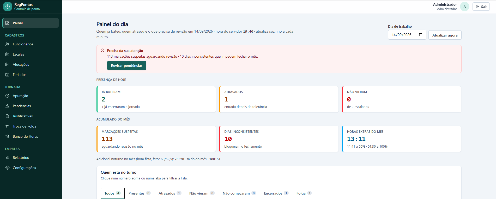
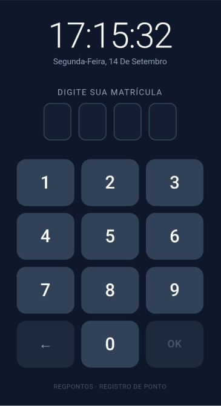
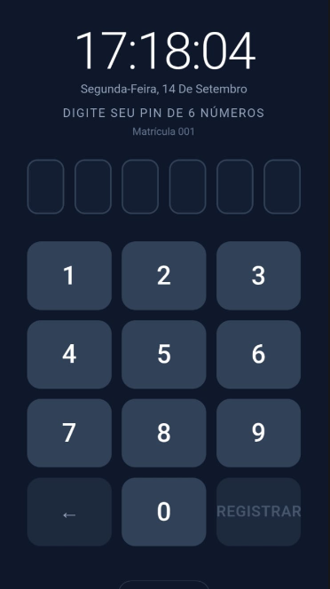
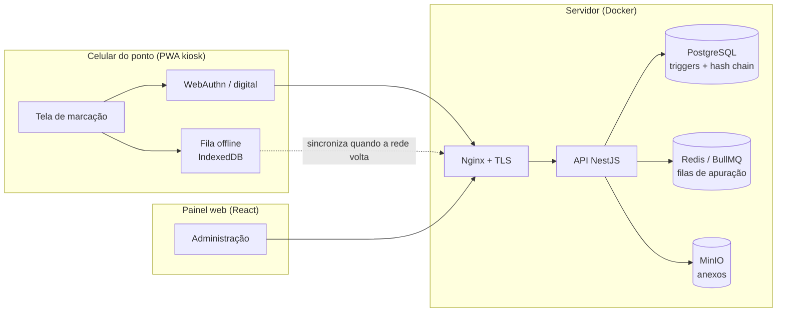

# RegPontos: Sistema de Ponto Eletrônico

> **Código-fonte privado.** Este repositório é uma vitrine do projeto: arquitetura,
> decisões técnicas e resultados. O código pode ser apresentado sob solicitação.

Sistema completo de registro e apuração de jornada de trabalho, em produção em um
estabelecimento do setor de alimentação. O funcionário bate o ponto com a **digital**
em um celular fixo na parede (PWA em modo kiosk). O administrador acompanha tudo em
um painel web: escalas, pendências, banco de horas, justificativas e relatórios.

---

## Em números

| | |
| --- | --- |
| ~41 mil linhas de TypeScript | API + front, sem contar testes |
| 277 testes automatizados | 22 suítes (Vitest) |
| 22 modelos de dados | PostgreSQL com triggers e constraints próprias |
| 10 módulos de domínio | ponto, escalas, apuração, banco de horas, relatórios… |

---

## Telas

### Painel do administrador

   
  Painel do dia: quem já bateu, atrasos, pendências que bloqueiam o fechamento, horas extras e adicional noturno do mês

### Kiosk do funcionário (celular na parede)
<table>
  <tr>
    <td align="center"> 1. Digita a matrícula</td>
    <td align="center"> 2. Digital com orientação quando a leitura falha</td>
    <td align="center"> 3. PIN de contingência (entra para conferência)</td>
  </tr>
</table>

---

## Arquitetura

---

## Destaques técnicos

### Registro com valor de prova
- **Marcações imutáveis**: `UPDATE` e `DELETE` são bloqueados **por trigger no
  PostgreSQL**, não só pela aplicação. Uma correção é sempre um registro novo
  (tratamento) ao lado do original.
- **Cadeia de hash** entre as marcações, calculada pelo próprio banco. O valor
  enviado pela aplicação é ignorado.
- **NSR sequencial** (número sequencial de registro) sem lacunas nem reinício.
- **A hora oficial é a do servidor**, lida do banco. O relógio do aparelho nunca
  é fonte de verdade.
- Script de verificação que **tenta violar cada garantia** e exige que todas falhem.

### Biometria sem guardar biometria
- Autenticação por digital via **WebAuthn / passkeys**. A digital nunca sai do
  aparelho; o servidor guarda só a chave pública.
- Cadastro por **QR Code** gerado no painel, para que nenhuma senha administrativa
  fique salva no navegador do kiosk.
- **PIN de contingência**. Toda batida por PIN entra automaticamente para
  conferência, como proteção contra "bater o ponto do colega".

### Funciona sem internet
- Batidas feitas offline ficam em uma **fila local no aparelho** e sincronizam
  sozinhas quando a rede volta, marcadas para conferência.
- **Nenhuma dependência de infraestrutura impede o registro**: sem Redis, a API
  sobe com aviso e a apuração roda de forma síncrona.

### Motor de jornada
- **Turnos que viram a meia-noite** (ex.: 16:00 → 00:20) representados em minutos
  desde o início do dia de referência, sem casos especiais.
- **Escalas cíclicas** de até 28 dias, com DSR e folgas alternadas, além de
  **troca de folga** entre funcionários.
- Apuração com tolerâncias, hora extra e **adicional noturno com hora ficta**
  (fator 60/52,5), conforme a CLT.
- O sistema **nunca recusa uma batida**: registra e sinaliza para revisão, como
  exige a Portaria MTP 671/2021.

### Banco de horas como ledger
- O saldo **nunca é uma coluna**: é sempre a soma de movimentos imutáveis.
- Expiração automática de crédito com modo de simulação antes de valer.
- Todos os valores são **minutos inteiros**. Nada de `float` em cálculo de jornada.

### Segurança e LGPD
- Autenticação JWT com **refresh rotativo e detecção de reuso**, teto absoluto de
  sessão, senhas com **Argon2**, RBAC por papel e **trilha de auditoria**.
- Limite de taxa, `helmet` e configuração correta de proxy confiável para que o IP
  auditado não possa ser forjado.
- **Retenção automática**: a chave biométrica é eliminada após o desligamento,
  dentro de um prazo configurável.
- Atestados médicos (dado sensível) armazenados **no Brasil**, sem transferência
  internacional.

### Relatórios e conformidade
- Espelho de ponto e relatórios em **PDF e Excel**.
- Geração de **AFD e AEJ** (Portaria 671) com assinatura digital por certificado
  e-CNPJ A1, protegida por feature flag.

---

## Stack

| Camada | Tecnologias |
| --- | --- |
| **Back-end** | NestJS 11, Prisma 6, PostgreSQL 16, BullMQ + Redis, `@simplewebauthn/server`, Argon2, Pino, PDFKit, ExcelJS, node-signpdf |
| **Front-end** | React 18, Vite 6, Tailwind CSS 4, TanStack Query, Zustand, React Router 7, `vite-plugin-pwa` |
| **Infraestrutura** | Docker Compose, Nginx (HTTP/2 + TLS), MinIO (S3), cloud-init, backup automatizado |
| **Qualidade** | Vitest (277 testes), TypeScript estrito |

---

## Contato

Desenvolvido por **Halyson Henrique**. Quer ver o código ou uma demonstração?
Entre em contato pelo [LinkedIn](https://www.linkedin.com/) ou pelo [GitHub](https://github.com/halysonhenrique).
